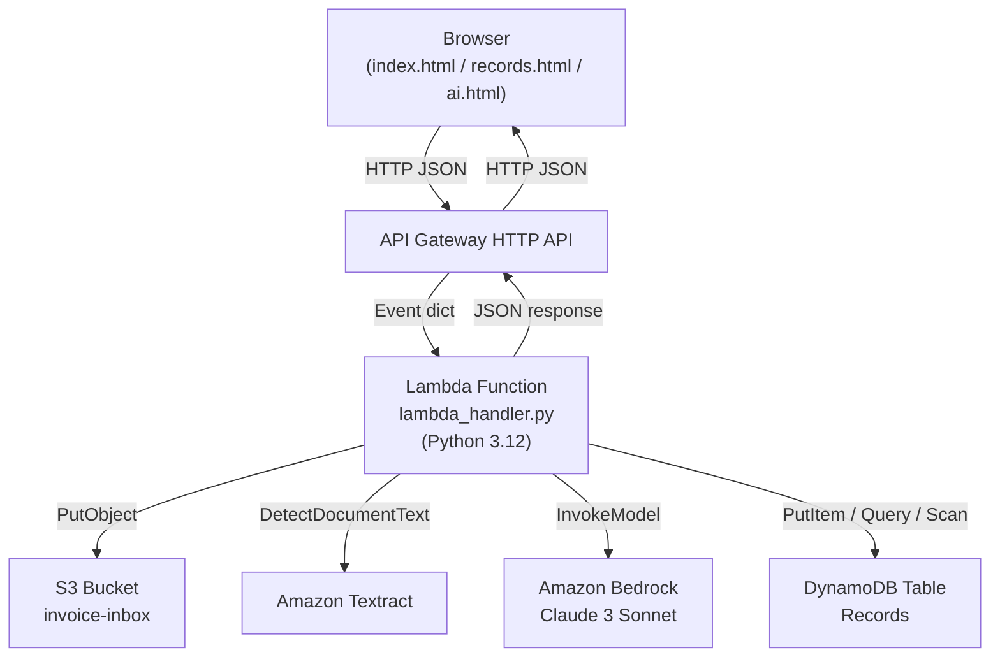
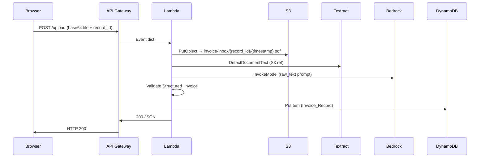

# Design Document: Financial Invoice Intelligence System

## Overview

The Financial Invoice Intelligence System is a single-Lambda serverless application on AWS. A single Python 3.12 function handles all routing, extraction, parsing, validation, storage, and AI generation. Three static HTML pages (index.html, records.html, ai.html) communicate with the backend exclusively through API Gateway HTTP API endpoints that return JSON.

The design prioritises simplicity: one file, one function, no orchestration layer, no queues, no framework dependencies beyond `boto3` and the Python standard library.

---

## Architecture



### Request Lifecycle



---

## Components and Interfaces

All components are implemented as Python functions within a single `lambda_handler.py` file. The top-level `lambda_handler(event, context)` function acts as the Orchestrator, routing by HTTP method and path.

### Orchestrator

**Responsibility**: Parse the API Gateway event, dispatch to the correct handler, attach CORS headers to every response.

```
lambda_handler(event, context) -> dict
  Routes on (httpMethod, routeKey / path):
    OPTIONS  *              -> handle_preflight()
    POST     /upload        -> handle_upload(event)
    GET      /records       -> handle_get_all_records()
    GET      /record/{id}   -> handle_get_record(record_id)
    POST     /ai/summary    -> handle_ai_summary(event)
    POST     /ai/dashboard  -> handle_ai_dashboard(event)
    *                       -> 404 JSON
```

**CORS wrapper**: A helper `make_response(status_code, body_dict)` adds CORS headers to every response dict before returning it to API Gateway.

### Extractor

**Responsibility**: Call Textract and return `raw_text`.

```
extract_text(bucket: str, key: str) -> str
  Calls textract.detect_document_text(Document={S3Object: {Bucket, Name}})
  Concatenates all LINE blocks with '\n'
  Returns empty string if no LINE blocks
  Raises RuntimeError on Textract failure
```

### Parser

**Responsibility**: Call Bedrock with a strict JSON-only prompt, parse the response, fall back on failure.

```
parse_invoice(raw_text: str) -> dict
  Builds prompt demanding JSON only with fields:
    invoice_id (str), vendor (str), amount (num), vat_amount (num), total (num)
  Calls bedrock.invoke_model(modelId, body)
  Parses response JSON
  On any parse failure returns fallback dict
```

Fallback: `{"invoice_id": "UNKNOWN", "vendor": "UNKNOWN", "amount": 0, "vat_amount": 0, "total": 0}`

### Validator

**Responsibility**: Apply deterministic rule-based checks in strict priority order, return `(status, validation_errors)`.

```
validate_invoice(data: dict) -> tuple[str, list[str]]
  Priority order (stops at first failure):
    1. INVALID_STRUCTURE  — any of the 5 required fields absent
    2. INVALID_TYPES      — amount / vat_amount / total not int or float
    3. INVALID_VALUES     — any of those three < 0
    4. MISMATCH           — abs(amount + vat_amount - total) > 0.01
    5. VALID              — all checks pass, errors = []
```

### Store

**Responsibility**: Write and read Invoice_Records in DynamoDB.

```
store_record(record_id, invoice_id, vendor, amount, vat_amount,
             total, status, validation_errors) -> str  # processed_at

get_all_records() -> dict  # {record_id: [Invoice_Record, ...]}

get_records_by_id(record_id: str) -> list[Invoice_Record]
```

Table name: `Records`  
Partition key: `record_id` (STRING)  
Sort key: `invoice_id` (STRING)

### AI_Summarizer

**Responsibility**: Retrieve records, call Bedrock for a summary JSON, parse or fall back.

```
generate_summary(record_id: str) -> dict
  Fetches Invoice_Records via get_records_by_id
  Returns 404 body if empty
  Builds prompt for anomaly / duplicate / VAT / risk analysis
  Parses Bedrock JSON response
  Falls back to {"summary": "AI analysis unavailable", "flags": [], "overall_risk_score": 0}
```

### AI_Dashboard

**Responsibility**: Retrieve records, call Bedrock for a financial dashboard JSON, parse or fall back.

```
generate_dashboard(record_id: str) -> dict
  Fetches Invoice_Records via get_records_by_id
  Returns 404 body if empty
  Builds prompt for totals / vendor breakdown / risk indicators
  Parses Bedrock JSON response
  Falls back to zero-value dashboard schema
```

---

## Data Models

### DynamoDB Table: `Records`

| Attribute         | Type          | Notes                                      |
|-------------------|---------------|--------------------------------------------|
| `record_id`       | STRING (PK)   | User-supplied grouping key                 |
| `invoice_id`      | STRING (SK)   | Extracted from invoice via Bedrock         |
| `vendor`          | STRING        | Extracted vendor name                      |
| `amount`          | NUMBER        | Net invoice amount                         |
| `vat_amount`      | NUMBER        | VAT component                              |
| `total`           | NUMBER        | Total amount (should equal amount+vat)     |
| `status`          | STRING        | One of: VALID, MISMATCH, INVALID_STRUCTURE, INVALID_TYPES, INVALID_VALUES |
| `validation_errors` | LIST(STRING)| Human-readable failure descriptions       |
| `processed_at`    | STRING        | UTC ISO 8601 timestamp                     |

### Structured_Invoice (in-memory)

```python
{
  "invoice_id": str,
  "vendor":     str,
  "amount":     float | int,
  "vat_amount": float | int,
  "total":      float | int
}
```

### API Response Shapes

**POST /upload — 200**
```json
{
  "record_id": "string",
  "invoice_id": "string",
  "status": "VALID | MISMATCH | INVALID_STRUCTURE | INVALID_TYPES | INVALID_VALUES",
  "validation_errors": ["string"],
  "processed_at": "ISO8601 string"
}
```

**GET /records — 200**
```json
{
  "RECORD_A": [ { ...Invoice_Record }, ... ],
  "RECORD_B": [ { ...Invoice_Record }, ... ]
}
```

**GET /record/{record_id} — 200**
```json
[ { ...Invoice_Record }, ... ]
```

**POST /ai/summary — 200**
```json
{
  "summary": "string",
  "flags": [{"type": "string", "invoice_id": "string", "severity": "low|medium|high"}],
  "overall_risk_score": 0.0
}
```

**POST /ai/dashboard — 200**
```json
{
  "totals": {"total_invoices": 0, "total_amount": 0, "average_invoice": 0},
  "vendor_breakdown": [{"vendor": "string", "total": 0}],
  "risk_indicators": {"high": 0, "medium": 0, "low": 0},
  "anomalies": ["string"]
}
```

**Error responses (all) — 4xx / 500**
```json
{"error": "string", "detail": "string"}
```

---

## Correctness Properties

*A property is a characteristic or behavior that should hold true across all valid executions of a system — essentially, a formal statement about what the system should do. Properties serve as the bridge between human-readable specifications and machine-verifiable correctness guarantees.*

### Property 1: Structured Invoice JSON round-trip

*For any* valid Structured_Invoice dict produced by the Parser, serializing it to a JSON string and then parsing that string back SHALL produce a dict equal to the original.

**Validates: Requirements 3.6**

---

### Property 2: Validator assigns exactly one status

*For any* input dict (including dicts with missing, non-numeric, negative, or mismatched fields), the Validator SHALL return exactly one of the five defined Validation_Status values and SHALL never return multiple statuses or raise an uncaught exception.

**Validates: Requirements 4.6**

---

### Property 3: INVALID_STRUCTURE fires before other checks

*For any* dict missing at least one required field, the Validator SHALL assign status `INVALID_STRUCTURE` regardless of the values of any other fields present.

**Validates: Requirements 4.1, 4.6**

---

### Property 4: INVALID_TYPES fires before value and mismatch checks

*For any* dict that has all required fields present but where at least one of `amount`, `vat_amount`, or `total` is a non-numeric type, the Validator SHALL assign status `INVALID_TYPES` and SHALL NOT assign `INVALID_VALUES` or `MISMATCH`.

**Validates: Requirements 4.2, 4.6**

---

### Property 5: INVALID_VALUES fires before mismatch check

*For any* dict that has all required fields present, all numeric, but at least one of `amount`, `vat_amount`, or `total` is negative, the Validator SHALL assign status `INVALID_VALUES` and SHALL NOT assign `MISMATCH`.

**Validates: Requirements 4.3, 4.6**

---

### Property 6: VALID status iff all invariants hold

*For any* dict where all five fields are present, all three numeric fields are non-negative, and `abs(amount + vat_amount - total) <= 0.01`, the Validator SHALL assign status `VALID` and set `validation_errors` to an empty list.

**Validates: Requirements 4.4, 4.5, 4.7**

---

### Property 7: MISMATCH error message references actual and expected totals

*For any* dict that triggers `MISMATCH` status, the `validation_errors` list SHALL contain exactly one string that includes both the computed total (`amount + vat_amount`) and the supplied `total` value.

**Validates: Requirements 4.4**

---

### Property 8: Whitespace and empty record_id handled without crash

*For any* upload request body where `record_id` is a non-empty string, the Orchestrator SHALL produce a well-formed S3 key and SHALL NOT raise an uncaught exception during key construction.

**Validates: Requirements 1.2**

---

## Error Handling

| Failure point         | HTTP status | Response body                                                         |
|-----------------------|-------------|-----------------------------------------------------------------------|
| S3 PutObject          | 500         | `{"error": "S3 upload failed", "detail": "<boto3 error message>"}`   |
| Textract call         | 500         | `{"error": "Textract extraction failed", "detail": "<error msg>"}`   |
| DynamoDB write        | 500         | `{"error": "DynamoDB write failed", "detail": "<error msg>"}`        |
| DynamoDB read         | 500         | `{"error": "DynamoDB read failed", "detail": "<error msg>"}`         |
| Bedrock (parse)       | silently falls back to default JSON — no error returned to caller    |
| record_id not found   | 404         | `{"error": "Record not found"}`                                      |
| Unknown route         | 404         | `{"error": "Not found"}`                                             |

All exceptions from AWS service calls are caught with `except Exception as e` within each component function. The caught exception message is placed in the `detail` field. This keeps the Orchestrator clean — components raise, the Orchestrator catches and formats.

CORS headers are attached to ALL responses, including error responses, so the browser always receives them.

---

## Testing Strategy

### Dual Testing Approach

**Unit tests** verify specific examples, edge cases, and error conditions using concrete inputs. They cover:
- Each Validator status path (one test per branch)
- Parser fallback behavior on invalid Bedrock JSON
- S3 key format correctness
- CORS header presence on all response types
- 404 on unknown routes
- 404 when record_id not found

**Property-based tests** verify universal properties across hundreds of generated inputs. They use [Hypothesis](https://hypothesis.readthedocs.io/) (pure Python, no Lambda layer needed for test execution).

### Property-Based Testing Configuration

Library: **Hypothesis** (Python)  
Minimum iterations: 100 per property (Hypothesis default is `max_examples=100`)  
Each test references its design property with a comment:

```python
# Feature: financial-invoice-intelligence, Property N: <property text>
@settings(max_examples=100)
@given(...)
def test_property_N_title(...):
    ...
```

### Property Tests

| Property | What varies | What is asserted |
|----------|-------------|-----------------|
| P1: JSON round-trip | Any valid Structured_Invoice dict | `json.loads(json.dumps(x)) == x` |
| P2: Single status always assigned | Any dict (Hypothesis `fixed_dictionaries` + `one_of`) | Result is one of 5 statuses, no exception |
| P3: INVALID_STRUCTURE fires first | Any dict with ≥1 missing required field | Status is `INVALID_STRUCTURE` |
| P4: INVALID_TYPES fires before value checks | All fields present, ≥1 non-numeric | Status is `INVALID_TYPES` |
| P5: INVALID_VALUES fires before mismatch | All fields present, numeric, ≥1 negative | Status is `INVALID_VALUES` |
| P6: VALID iff all invariants hold | Valid amount/vat with consistent total | Status is `VALID`, errors empty |
| P7: MISMATCH message content | Mismatched amount+vat vs total | Error string contains both values |
| P8: S3 key construction | Any non-empty string record_id | Key matches expected pattern, no crash |

### Unit Tests

- Validator: one test per status branch, plus boundary cases (total exactly 0.01 off)
- Parser: valid JSON response → parsed dict; invalid JSON → fallback dict
- CORS: every `make_response()` call returns the three required headers
- Routing: POST /upload, GET /records, GET /record/{id}, POST /ai/summary, POST /ai/dashboard, OPTIONS
- AI fallback: Bedrock parse failure returns defined fallback body
- Store integration tests (mocked with `moto` or `unittest.mock`)

### Test Infrastructure

Tests run locally against the single Python file using `pytest` + `hypothesis` + `unittest.mock` (to mock all AWS service calls). No Lambda layer or real AWS credentials are needed to run the test suite.
